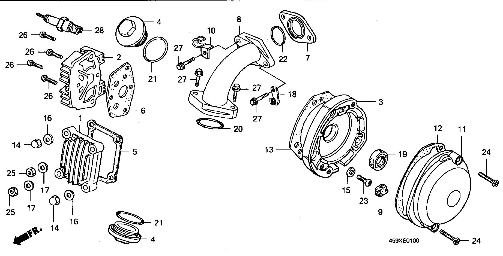
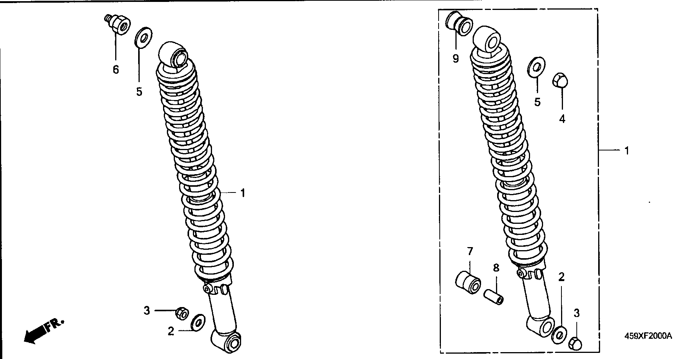
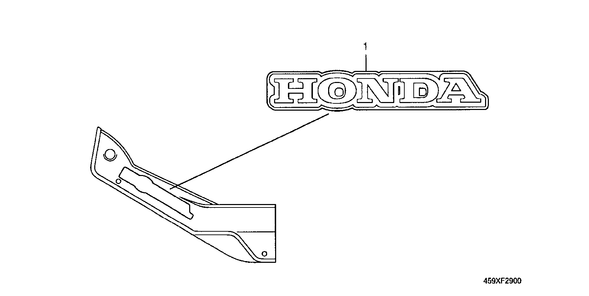

# Honda CT110X (1999) Parts

- [Cylinder Head Cover](#cylinder-head-cover)
- [Cylinder Head](#cylinder-head)
- [Camshaft/Valve](#camshaftvalve)
- [Cam Chain/Tensioner](#cam-chaintensioner)
- [Cylinder](#cylinder)
- [Right Crankcase Cover](#right-crankcase-cover)
- [Clutch](#clutch)
- [Oil Pump](#oil-pump)
- [Left Crankcase Cover](#left-crankcase-cover)
- [Generator](#generator)
- [Crankcase](#crankcase)
- [Crankcase/Piston](#crankcasepiston)
- [Transmission](#transmission)
- [Gearshift Drum](#gearshift-drum)
- [Kick Starter Spindle](#kick-starter-spindle)
- [Carburetor](#carburetor)
- [Gasket Kit A](#gasket-kit-a)
- [Gasket Kit B](#gasket-kit-b)
- [Headlight](#headlight)
- [Speedometer](#speedometer)
- [Switch/Cable](#switchcable)
- [Handle Pipe/Top Bridge](#handle-pipetop-bridge)
- [Steering Stem](#steering-stem)
- [Front Fender](#front-fender)
- [Front Fork](#front-fork)
- [Front Brake Panel](#front-brake-panel)
- [Front Wheel](#front-wheel)
- [Rear Brake Panel](#rear-brake-panel)
- [Rear Wheel](#rear-wheel)
- [Fuel Tank](#fuel-tank)
- [Seat/Rear Carrier](#seatrear-carrier)
- [Air Cleaner](#air-cleaner)
- [Exhaust Muffler](#exhaust-muffler)
- [Pedal/Kick Starter Arm](#pedalkick-starter-arm)
- [Step](#step)
- [Stand](#stand)
- [Swingarm/Chain Case](#swingarmchain-case)
- [Rear Cushion](#rear-cushion)
- [Winker](#winker)
- [Taillight](#taillight)
- [Battery](#battery)
- [Wire Harness](#wire-harness)
- [Frame Body](#frame-body)
- [Tools](#tools)
- [Main Pipe Cover](#main-pipe-cover)
- [Caution Label](#caution-label)
- [Mark](#mark)

## Cylinder Head Cover

| Number | Name | Quantity | Price |
| ------ | ---- | -------- | ----- |
| 1 | COVER, CYLINDER HEAD | 1 | 22.92 |
| 2 | COVER, R. CYLINDER HEAD SIDE | 1 | 33.7 |
| 3 | BASE, CONTACT BREAKER | 1 | 24.99 |
| 4 | CAP, TAPPET ADJUSTING HOLE | 2 | 5.91 |
| 5 | GASKET, CYLINDER HEAD COVER | 1 | 0 |
| 6 | GASKET, VALVE ROCKER ARM SIDE COVER | 1 | 0 |
| 7 | INSULATOR, CARBURETOR | 1 | 7.64 |
| 8 | PIPE, IN. | 1 | 51.83 |
| 9 | GROMMET, PRIMARY CORD | 1 | 6.46 |
| 10 | CLIP, HIGH TENSION CORD | 1 | 6.28 |
| 11 | COVER, POINT | 1 | 18.87 |
| 12 | GASKET, POINT COVER | 1 | 0 |
| 13 | GASKET, POINT BASE | 1 | 0 |
| 14 | NUT, CAP, 8MM | 2 | 4.26 |
| 15 | WASHER, SEALING, 6MM | 3 | 3.72 |
| 16 | WASHER, SEALING, 8MM | 2 | 3.72 |
| 17 | WASHER, 8MM | 2 | 3.72 |
| 18 | CLAMP, RR. BRAKE CABLE | 1 | 6.07 |
| 19 | OIL SEAL, 13X22X5(NOK) | 1 | 7.87 |
| 20 | O-RING, 27X2.0(ARAI) | 1 | 3.31 |
| 21 | O-RING, 30.8MM | 2 | 1.0 |
| 22 | O-RING, 25X2.4 | 1 | 0 |
| 23 | SCREW, PAN, 6X12 | 3 | 0.6 |
| 24 | SCREW, OVAL, 5X22 | 2 | 2.19 |
| 25 | NUT, HEX., 8MM | 2 | 0.63 |
| 26 | BOLT, FLANGE, 6X20 | 4 | 1.79 |
| 27 | BOLT, FLANGE, 6X25 | 4 | 1.03 |
| 28 | PLUG, SPARK (DR8ES-L)(NGK) | 1 | 0 |
| 28 | PLUG, SPARK (X24ESR-U)(DENSO) | 1 | 0 |
| 28 | PLUG, SPARK (DR7ES)(NGK) | 1 | 0 |
| 28 | PLUG, SPARK (X22ESR-U)(DENSO) | 1 | 0 |
| 28 | PLUG, SPARK (DR8ES)(NGK) | 1 | 0 |
| 28 | PLUG, SPARK (X27ESR-U)(DENSO) | 1 | 0 |

## Cylinder Head

| Number | Name | Quantity | Price |
| ------ | ---- | -------- | ----- |
| 1 | GUIDE, IN. VALVE | 1 | 22.04 |
| 2 | GUIDE, EX. VALVE | 1 | 22.04 |
| 3 | HEAD COMP., CYLINDER | 1 | 308.93 |
| 4 | GASKET, CYLINDER HEAD | 1 | 21.42 |
| 5 | BOLT, STUD, 6X32 | 2 | 4.09 |
| 6 | BOLT, 6MM | 2 | 4.09 |
| 7 | O-RING, 9X1.6(ARAI) | 2 | 0 |

## Camshaft/Valve

| Number | Name | Quantity | Price |
| ------ | ---- | -------- | ----- |
| 1 | SEAL, VALVE STEM (ARAI) | 1 | 8.88 |
| 2 | CAMSHAFT | 1 | 0 |
| 3 | ARM, VALVE ROCKER | 2 | 46.01 |
| 4 | SHAFT, VALVE ROCKER ARM | 2 | 10.43 |
| 5 | VALVE, IN. | 1 | 46.1 |
| 6 | VALVE, EX. | 1 | 60.91 |
| 7 | SPRING, VALVE OUTER | 2 | 6.05 |
| 8 | SPRING, VALVE INNER | 2 | 5.61 |
| 9 | RETAINER, VALVE SPRING | 2 | 7.87 |
| 10 | SEAT, VALVE SPRING OUTER | 2 | 4.87 |
| 11 | COTTER, VALVE (SANKO) | 4 | 3.42 |
| 12 | SCREW, TAPPET ADJUSTING | 2 | 3.13 |
| 13 | NUT, TAPPET ADJUSTING | 2 | 2.72 |

## Cam Chain/Tensioner

| Number | Name | Quantity | Price |
| ------ | ---- | -------- | ----- |
| 1 | SPROCKET, CAM (30T) | 1 | 38.57 |
| 2 | CHAIN, CAM (92L DAIDO) | 1 | 40.35 |
| 3 | TENSIONER COMP., CAM CHAIN | 1 | 41.55 |
| 4 | SPRING A, CAM CHAIN TENSIONER | 1 | 6.46 |
| 5 | SPRING B, CAM CHAIN TENSIONER | 1 | 6.07 |
| 6 | ROD COMP., CAM CHAIN TENSIONER PUSH | 1 | 20.53 |
| 7 | BOLT, CAM CHAIN TENSIONER ADJUSTING | 1 | 8.01 |
| 8 | HEAD, CAM CHAIN TENSIONER PUSH ROD | 1 | 4.29 |
| 9 | BOLT B, CAM CHAIN TENSIONER ADJUSTING | 1 | 7.91 |
| 10 | PLATE, TENSIONER SETTING | 1 | 5.8 |
| 11 | PLATE B, CAM CHAIN TENSIONER SETTING | 1 | 4.09 |
| 12 | ROLLER, CAM CHAIN GUIDE | 1 | 15.51 |
| 13 | PIN, CAM CHAIN GUIDE ROLLER | 1 | 6.07 |
| 14 | SPROCKET COMP., CAM CHAIN GUIDE (29T) | 1 | 44.56 |
| 15 | BOLT, SEALING, 14MM | 1 | 7.0 |
| 16 | WASHER, SEALING, 14MM | 1 | 2.97 |
| 17 | WASHER, 8MM | 1 | 3.72 |
| 18 | O-RING, 5.5X1.5 | 1 | 3.7 |
| 19 | BOLT, HEX., 6X10 | 2 | 2.09 |
| 20 | NUT, HEX., 8MM | 1 | 0.6 |
| 21 | BOLT, FLANGE, 6X12 | 3 | 2.3 |

## Cylinder

| Number | Name | Quantity | Price |
| ------ | ---- | -------- | ----- |
| 1 | CYLINDER COMP. | 1 | 0 |
| 2 | GASKET, CYLINDER | 1 | 0 |
| 3 | BOLT, SEALING, 6MM | 2 | 0 |
| 4 | DOWEL PIN, 10X14 | 4 | 0 |

## Right Crankcase Cover

| Number | Name | Quantity | Price |
| ------ | ---- | -------- | ----- |
| 1 | COVER COMP., R. CRANKCASE | 1 | 0 |
| 1 | COVER COMP., R. CRANKCASE | 1 | 203.76 |
| 2 | PROTECTOR, R. CRANKCASE COVER | 1 | 8.01 |
| 3 | GASKET, R. CRANKCASE COVER | 1 | 0 |
| 4 | GAUGE, OIL LEVEL | 1 | 7.0 |
| 5 | LEVER, CLUTCH | 1 | 30.66 |
| 6 | PLATE COMP., CLUTCH CAM | 1 | 24.9 |
| 7 | SPRING, CAM PLATE SIDE | 1 | 2.57 |
| 8 | PLATE COMP., CLUTCH LIFTER | 1 | 13.65 |
| 9 | BOLT, CLUTCH ADJUSTING | 1 | 5.69 |
| 10 | RETAINER, CLUTCH BALL | 1 | 5.34 |
| 11 | THROUGH, OIL | 1 | 0 |
| 12 | SPRING, OIL THROUGH | 1 | 2.64 |
| 13 | WASHER, CLUTCH ADJUSTING | 1 | 7.91 |
| 14 | DOWEL PIN, 10X14 | 2 | 0 |
| 15 | OIL SEAL, 16X28X7 | 1 | 8.44 |
| 16 | O-RING, 8MM | 1 | 0 |
| 17 | O-RING, 18X3 | 1 | 1.0 |
| 18 | NUT, HEX., 8MM | 1 | 0.63 |
| 19 | BOLT, FLANGE, 6X25 | 7 | 1.03 |
| 20 | BOLT, FLANGE, 6X40 | 2 | 3.52 |

## Clutch

| Number | Name | Quantity | Price |
| ------ | ---- | -------- | ----- |
| 1 | OUTER, CLUTCH | 1 | 56.53 |
| 2 | COVER, CLUTCH OUTER | 1 | 10.39 |
| 3 | GASKET, CLUTCH OUTER COVER | 1 | 0 |
| 4 | CENTER, CLUTCH | 1 | 85.41 |
| 5 | GUIDE, CLUTCH CENTRE | 1 | 27.56 |
| 6 | DISK, CLUTCH FRICTION | 3 | 16.97 |
| 7 | PLATE A, CLUTCH | 1 | 15.73 |
| 8 | PLATE B, CLUTCH | 1 | 8.01 |
| 9 | PLATE C, CLUTCH | 1 | 8.01 |
| 10 | PLATE D, CLUTCH | 1 | 10.39 |
| 11 | SPRING, CLUTCH | 4 | 6.67 |
| 12 | SPRING, CLUTCH FREE | 4 | 4.28 |
| 13 | SPRING, CLUTCH DAMPER | 4 | 2.64 |
| 14 | PLATE, DRIVE | 1 | 100.7 |
| 15 | WEIGHT, CLUTCH | 28 | 3.87 |
| 16 | RING, CLUTCH WEIGHT CENTRE | 1 | 7.14 |
| 17 | RING, CLUTCH WEIGHT STOPPER | 1 | 7.14 |
| 18 | SET RING, 102.5MM | 1 | 5.34 |
| 19 | COLLAR, 20MM | 1 | 8.46 |
| 20 | GEAR, PRIMARY DRIVEN (67T) | 1 | 142.51 |
| 21 | GEAR, DRIVE (18T) | 1 | 0 |
| 22 | NUT, LOCK, 16MM | 1 | 0 |
| 23 | WASHER, LOCK, 16MM | 1 | 2.64 |
| 24 | WASHER, LOCK | 1 | 6.28 |
| 25 | WASHER, THRUST, 36MM | 1 | 11.11 |
| 26 | WASHER, STOPPER, 14MM | 4 | 3.72 |
| 27 | CIRCLIP, 38MM | 1 | 7.37 |
| 28 | SCREW, PAN, 5X8 | 4 | 0.46 |
| 29 | SCREW, FLAT, 5X12 | 2 | 0.53 |
| 30 | CIRCLIP, EXTERNAL, 20MM | 1 | 0 |
| 31 | BEARING, RADIAL BALL, 6000 | 1 | 7.75 |

## Oil Pump

| Number | Name | Quantity | Price |
| ------ | ---- | -------- | ----- |
| 1 | PUMP ASSY., OIL | 1 | 56.73 |
| 2 | GASKET, OIL PUMP BODY | 1 | 0 |
| 3 | GASKET, OIL PUMP COVER | 1 | 2.37 |
| 6 | SCREEN, OIL FILTER | 1 | 6.35 |
| 7 | BOLT, OIL JOINT | 1 | 5.69 |
| 8 | WASHER C, 8MM | 1 | 1.28 |
| 9 | SCREW, PAN, 5X10 | 2 | 0.78 |
| 10 | SCREW, PAN, 6X16 | 1 | 1.42 |
| 11 | SCREW, PAN, 6X25 | 2 | 0.53 |
| 12 | ROTOR SET, OIL PUMP | 1 | 0 |

## Left Crankcase Cover

| Number | Name | Quantity | Price |
| ------ | ---- | -------- | ----- |
| 1 | COVER, L. CRANKCASE | 1 | 180.05 |
| 1 | COVER, L. CRANKCASE | 1 | 0 |
| 2 | COVER, L. CRANKCASE RR. | 1 | 0 |
| 2 | COVER, L. CRANKCASE RR. | 1 | 43.84 |
| 3 | GASKET, L. CRANKCASE COVER | 1 | 0 |
| 4 | CLAMPER | 1 | 9.82 |
| 5 | CLIP, BREATHER TUBE | 1 | 5.38 |
| 6 | CAP, A.C. GENERATOR | 1 | 0 |
| 7 | CAP, 30MM | 1 | 14.87 |
| 8 | DOWEL PIN, 8X12 | 1 | 0 |
| 9 | DOWEL PIN, 10X14 | 1 | 0 |
| 10 | O-RING, 27.4X2.4(ARAI) | 1 | 0 |
| 11 | O-RING, 13.8X2.5 | 1 | 0 |
| 12 | BOLT, FLANGE, 6X25 | 9 | 1.03 |
| 13 | BOLT, FLANGE, 6X35 | 2 | 2.13 |

## Generator

| Number | Name | Quantity | Price |
| ------ | ---- | -------- | ----- |
| 1 | FLYWHEEL COMP. | 1 | 273.14 |
| 2 | STATOR COMP. | 1 | 380.11 |
| 3 | CLAMPER, GENERATOR CORD | 1 | 6.28 |
| 4 | GROMMET, NEUTRAL SWITCH CORD | 1 | 8.27 |
| 5 | BOLT, SOCKET, 5X14 | 3 | 3.72 |
| 6 | BOLT, SOCKET, 6X30 | 3 | 6.46 |
| 7 | NUT, 14MM | 1 | 6.28 |
| 8 | WASHER, PLAIN, 14MM | 1 | 6.28 |

## Crankcase

| Number | Name | Quantity | Price |
| ------ | ---- | -------- | ----- |
| 1 | CRANKCASE COMP., R. | 1 | 330.16 |
| 2 | GASKET, CRANKCASE | 1 | 0 |
| 3 | CRANKCASE COMP., L. | 1 | 337.88 |
| 4 | BOLT A, CYLINDER STUD | 2 | 12.92 |
| 5 | BOLT B, CYLINDER STUD | 2 | 12.92 |
| 6 | PACKING, DRAIN COCK, 12.5X20 | 1 | 3.12 |
| 7 | DOWEL PIN, 10X14 | 2 | 0 |
| 8 | BOLT, DRAIN PLUG, 12MM | 1 | 5.23 |
| 9 | SCREW, PAN, 6X40 | 9 | 0.53 |

## Crankcase/Piston

| Number | Name | Quantity | Price |
| ------ | ---- | -------- | ----- |
| 1 | CRANKSHAFT COMP. | 1 | 570.12 |
| 2 | RING SET, PISTON (STD.)(NIPPON) | 1 | 0 |
| 2 | RING SET, PISTON (0.25)(NIPPON) | 1 | 0 |
| 2 | RING SET, PISTON (0.50)(NIPPON) | 1 | 0 |
| 2 | RING SET, PISTON (0.75)(NIPPON) | 1 | 0 |
| 2 | RING SET, PISTON (1.00)(NIPPON) | 1 | 0 |
| 3 | PISTON (STD.) | 1 | 71.27 |
| 3 | PISTON (0.25) | 1 | 77.08 |
| 3 | PISTON (0.50) | 1 | 77.08 |
| 3 | PISTON (0.75) | 1 | 77.08 |
| 3 | PISTON (1.00) | 1 | 77.08 |
| 4 | PIN, PISTON | 1 | 15.59 |
| 5 | ROD, CONNECTING | 1 | 107.02 |
| 6 | CRANKSHAFT, R. | 1 | 262.81 |
| 7 | CRANKSHAFT, L. | 1 | 262.81 |
| 8 | PIN, CRANK | 1 | 56.53 |
| 9 | SPROCKET, TIMING (15T) | 1 | 32.71 |
| 10 | KEY, WOODRUFF, 4MM | 1 | 0 |
| 11 | BEARING, RADIAL BALL, 6305 (NACHI) | 2 | 23.86 |
| 12 | BEARING, CONNECTING ROD LARGE END (RED)(TOYO) | 1 | 20.51 |
| 12 | BEARING, CONNECTING ROD LARGE END (RED)(KOYO) | 1 | 0 |
| 12 | BEARING, CONNECTING ROD LARGE END (BLUE)(TOYO) | 1 | 21.9 |
| 12 | BEARING, CONNECTING ROD LARGE END (BLUE)(KOYO) | 1 | 0 |
| 12 | BEARING, CONNECTING ROD LARGE END (WHITE)(TOYO) | 1 | 21.9 |
| 12 | BEARING, CONNECTING ROD LARGE END (WHITE)(KOYO) | 1 | 0 |
| 13 | CLIP, PISTON PIN, 15MM | 2 | 0.6 |

## Transmission

| Number | Name | Quantity | Price |
| ------ | ---- | -------- | ----- |
| 1 | MAINSHAFT, TRANSMISSION (13T) | 1 | 86.42 |
| 2 | COUNTERSHAFT, TRANSMISSION (23T) | 1 | 127.71 |
| 3 | GEAR COMP., COUNTERSHAFT LOW (33T) | 1 | 65.22 |
| 4 | GEAR, MAINSHAFT SECOND (18T) | 1 | 57.93 |
| 5 | GEAR, COUNTERSHAFT SECOND (29T) | 1 | 67.03 |
| 6 | GEAR, MAINSHAFT THIRD (21T) | 1 | 64.01 |
| 7 | GEAR, COUNTERSHAFT THIRD (25T) | 1 | 54.88 |
| 8 | GEAR, MAINSHAFT TOP (24T) | 1 | 55.22 |
| 9 | SPROCKET, DRIVE (15T) | 1 | 50.53 |
| 10 | PLATE A2, FIXING | 1 | 3.7 |
| 11 | WASHER, THRUST, 14MM | 1 | 3.87 |
| 12 | WASHER, SPLINE, 18MM | 1 | 4.09 |
| 13 | WASHER, SPLINE, 20MM | 1 | 6.57 |
| 14 | CIRCLIP, 18MM | 1 | 2.86 |
| 15 | CIRCLIP, 20MM | 1 | 6.07 |
| 16 | OIL SEAL, 20X37X7 | 1 | 6.67 |
| 17 | BOLT, HEX., 6X10 | 2 | 2.09 |
| 18 | BEARING, RADIAL BALL, 6004 | 1 | 11.26 |
| 19 | BEARING, RADIAL BALL, 6204 | 1 | 11.26 |

## Gearshift Drum

| Number | Name | Quantity | Price |
| ------ | ---- | -------- | ----- |
| 1 | FORK, R. GEARSHIFT | 1 | 65.57 |
| 2 | FORK, L. GEARSHIFT | 1 | 65.57 |
| 3 | PIN, GEARSHIFT FORK GUIDE | 2 | 1.8 |
| 4 | CLIP, GEARSHIFT FORK GUIDE PIN | 2 | 4.09 |
| 5 | DRUM, GEARSHIFT | 1 | 77.74 |
| 6 | PIN, GEARSHIFT DRUM | 4 | 6.52 |
| 7 | PLATE, GEARSHIFT DRUM STOPPER | 1 | 7.0 |
| 8 | ARM COMP., SHIFT DRUM STOPPER | 1 | 17.29 |
| 9 | SPRING, DRUM STOPPER | 1 | 3.99 |
| 10 | SPINDLE COMP., GEARSHIFT | 1 | 41.55 |
| 11 | ARM, GEARSHIFT | 1 | 28.75 |
| 12 | SPRING, GEARSHIFT ARM | 1 | 4.21 |
| 13 | SPRING, GEARSHIFT RETURN | 1 | 5.34 |
| 14 | PIN, SHIFT RETURN SPRING | 1 | 7.91 |
| 15 | CONTACT ASSY., NEUTRAL SWITCH | 1 | 9.21 |
| 16 | SPACER, NEUTRAL SWITCH | 1 | 3.07 |
| 17 | ROTOR, NEUTRAL SWITCH | 1 | 0 |
| 18 | BOLT, GEARSHIFT DRUM STOPPER ARM PIVOT | 1 | 3.42 |
| 19 | BOLT, KNOCK, 6MM | 1 | 4.29 |
| 20 | WASHER, GEARSHIFT DRUM SIDE | 1 | 3.72 |
| 21 | OIL SEAL, 11.6X24X10 | 1 | 0 |
| 22 | BOLT, HEX., 6X16 | 1 | 0.56 |
| 23 | ROLLER, 3X8.5 | 2 | 0.25 |

## Kick Starter Spindle

| Number | Name | Quantity | Price |
| ------ | ---- | -------- | ----- |
| 1 | SPINDLE COMP., KICK STARTER | 1 | 126.63 |
| 2 | GUIDE, KICK STARTER SPRING | 1 | 8.08 |
| 3 | SPRING, KICK STARTER | 1 | 8.47 |
| 4 | SPRING, STARTER PINION FRICTION | 1 | 4.21 |

## Carburetor

| Number | Name | Quantity | Price |
| ------ | ---- | -------- | ----- |
| 1 | GASKET SET | 1 | 0 |
| 2 | NEEDLE SET, JET | 1 | 41.55 |
| 3 | FLOAT SET | 1 | 52.49 |
| 4 | TOP SET | 1 | 0 |
| 5 | CHAMBER SET, FLOAT | 1 | 192.81 |
| 6 | SCREW SET A | 1 | 30.66 |
| 7 | VALVE SET, THROTTLE | 1 | 41.55 |
| 8 | SCREW SET B | 1 | 22.73 |
| 9 | GASKET SET B | 1 | 14.46 |
| 10 | NUT SET, SQUARE | 1 | 5.08 |
| 11 | CARBURETOR ASSY. (PB10H B) | 1 | 314.76 |
| 12 | CAP, CABLE SEALING | 1 | 15.25 |
| 13 | CAP, CHOKE DUST | 1 | 5.18 |
| 14 | VALVE COMP., FLOAT | 1 | 33.17 |
| 15 | HOLDER, NEEDLE JET | 1 | 59.07 |
| 16 | CUP, FUEL STRAINER | 1 | 43.7 |
| 17 | SCREEN, FUEL STRAINER | 1 | 24.9 |
| 18 | TUBE, OVERFLOW | 1 | 10.61 |
| 19 | TUBE, FUEL | 1 | 0 |
| 20 | BODY SET, FUEL COCK | 1 | 27.59 |
| 21 | SCREW, PAN, 3X12 | 2 | 0.63 |
| 22 | SCREW-WASHER, 4X14 | 2 | 1.28 |
| 23 | WASHER, SPRING, 3MM | 2 | 1.19 |
| 24 | CLIP, TUBE (B6.5) | 2 | 1.36 |
| 25 | JET, MAIN, #72 | 1 | 0 |
| 26 | JET, SLOW, #38 | 1 | 11.06 |

## Gasket Kit A

| Number | Name | Quantity | Price |
| ------ | ---- | -------- | ----- |
| 1 | GASKET KIT A (COMPONENT PARTS) | 1 | 0 |
| 1 | GASKET, CYLINDER | 1 | 0 |
| 1 | SEAL, VALVE STEM (ARAI) | 1 | 8.88 |
| 1 | GASKET, CYLINDER HEAD | 1 | 21.42 |
| 1 | GASKET, CYLINDER HEAD COVER | 1 | 0 |
| 1 | GASKET, VALVE ROCKER ARM SIDE COVER | 1 | 0 |
| 1 | GASKET, EX. PIPE | 1 | 5.99 |
| 1 | GASKET, POINT COVER | 1 | 0 |
| 1 | GASKET, POINT BASE | 1 | 0 |
| 1 | O-RING, 27X2.0(ARAI) | 1 | 3.31 |
| 1 | O-RING, 30.8MM | 2 | 1.0 |
| 1 | O-RING, 25X2.4 | 1 | 0 |

## Gasket Kit B

| Number | Name | Quantity | Price |
| ------ | ---- | -------- | ----- |
| 1 | GASKET KIT B (COMPONENT PARTS) | 1 | 0 |
| 1 | GASKET, CRANKCASE | 1 | 0 |
| 1 | GASKET, R. CRANKCASE COVER | 1 | 0 |
| 1 | GASKET, L. CRANKCASE COVER | 1 | 0 |
| 1 | GASKET, OIL PUMP BODY | 1 | 0 |
| 1 | GASKET, OIL PUMP COVER | 1 | 2.37 |
| 1 | GASKET, CLUTCH OUTER COVER | 1 | 0 |
| 1 | PACKING, DRAIN COCK, 12.5X20 | 1 | 3.12 |
| 1 | O-RING, 27.4X2.4(ARAI) | 1 | 0 |
| 1 | O-RING, 13.8X2.5 | 1 | 0 |
| 1 | O-RING, 18X3 | 1 | 1.0 |
| 1 | O-RING, 8MM | 1 | 0 |

## Headlight

| Number | Name | Quantity | Price |
| ------ | ---- | -------- | ----- |
| 1 | HEADLIGHT ASSY. (STANLEY)(12V 35/35W) | 1 | 234.93 |
| 2 | RIM, HEADLIGHT | 1 | 47.46 |
| 3 | SPRING, UNIT HOLDER (STANLEY) | 3 | 3.31 |
| 4 | SOCKET ASSY., HEADLIGHT | 1 | 27.3 |
| 5 | HEADLIGHT UNIT | 1 | 115.76 |
| 6 | BULB, HEADLIGHT (12V 35/35W) | 1 | 44.68 |
| 7 | CASE, HEADLIGHT *NH43* PHANTOM BLACK | 1 | 41.22 |
| 8 | COLLAR, HEADLIGHT CASE | 2 | 10.95 |
| 9 | WASHER, HEADLIGHT CASE | 1 | 5.38 |
| 10 | NUT, HEADLIGHT CASE | 1 | 7.14 |
| 11 | COVER, HEADLIGHT CASE | 1 | 42.43 |
| 12 | NUT, HEADLIGHT CASE SETTING | 1 | 0 |
| 13 | SCREW-WASHER, 5X12 | 1 | 0 |
| 14 | BOLT, FLANGE, 10X20 | 2 | 2.04 |

## Speedometer

| Number | Name | Quantity | Price |
| ------ | ---- | -------- | ----- |
| 1 | BULB, WEDGE BASE (T10)(12V 3.4W) | 1 | 0 |
| 2 | BULB, WEDGE BASE (12V 1.7W) | 3 | 4.81 |
| 3 | SPEEDOMETER ASSY. | 1 | 308.93 |
| 4 | WASHER, 18MM | 2 | 2.97 |
| 5 | SPEEDOMETER COMP. | 1 | 252.33 |
| 6 | STAY, METER | 1 | 19.36 |
| 7 | SOCKET COMP., ILLUMINATION | 1 | 38.15 |
| 8 | CUSHION, METER | 1 | 21.4 |
| 9 | COLLAR, METER SETTING | 2 | 3.23 |
| 10 | RUBBER, METER SETTING | 2 | 3.13 |
| 11 | CABLE ASSY., SPEEDOMETER | 1 | 23.71 |
| 12 | CABLE, INNER | 1 | 0 |
| 13 | O-RING | 1 | 4.09 |
| 14 | NUT, HEX., 6MM | 2 | 1.36 |
| 15 | NUT, FLANGE, 8MM | 1 | 1.99 |
| 16 | RING, METER SETTING | 1 | 31.13 |

## Switch/Cable

| Number | Name | Quantity | Price |
| ------ | ---- | -------- | ----- |
| 1 | CABLE COMP., THROTTLE | 1 | 29.73 |
| 2 | SWITCH ASSY., KILL | 1 | 104.52 |
| 3 | SWITCH ASSY., WINNER | 1 | 110.93 |
| 4 | SWITCH ASSY., FR. STOP | 1 | 15.22 |
| 5 | CABLE COMP., FR. BRAKE | 1 | 0 |
| 6 | SPRING, FR. BRAKE CABLE | 1 | 0.65 |
| 7 | GRIP ASSY., THROTTLE | 1 | 0 |
| 7 | GRIP ASSY., THROTTLE | 1 | 23.11 |
| 8 | GRIP, R. HANDLE | 1 | 8.01 |
| 9 | GRIP, L. HANDLE | 1 | 0 |
| 9 | GRIP, L. HANDLE | 1 | 8.44 |
| 10 | HOLDER, BACK MIRROR | 2 | 80.63 |
| 11 | LEVER, R. STEERING HANDLE | 1 | 28.3 |
| 12 | LEVER COMP., PARKING | 1 | 12.76 |
| 13 | SPRING, RETURN | 1 | 3.77 |
| 14 | PIN, PARKING LEVER PIVOT | 1 | 2.64 |
| 15 | BOOT, FR. STOP SWITCH | 1 | 3.24 |
| 16 | BOLT, WIRE ADJUSTING | 1 | 9.5 |
| 17 | MIRROR COMP. | 2 | 30.04 |
| 18 | BOLT, HANDLE LEVER PIVOT | 1 | 5.09 |
| 19 | NUT, FIXING | 1 | 8.33 |
| 20 | WASHER, PLAIN, 4X8 | 1 | 0 |
| 21 | BAND, WIRE | 2 | 4.97 |
| 22 | PURSE, LOCK, 8MM | 1 | 3.72 |
| 23 | SCREW, PAN, 5X28 | 4 | 0 |
| 24 | NUT, HEX., 6MM | 1 | 0 |
| 25 | PIN, SPLIT, 1.6X12 | 1 | 1.25 |
| 26 | BOLT, FLANGE, 6X25 | 2 | 2.65 |
| 27 | NUT, LOCK | 2 | 7.14 |

## Handle Pipe/Top Bridge

| Number | Name | Quantity | Price |
| ------ | ---- | -------- | ----- |
| 1 | PIPE, STEERING HANDLE | 1 | 134.25 |
| 1 | PIPE, STEERING HANDLE | 1 | 0 |
| 2 | WEIGHT, HANDLE | 2 | 22.32 |
| 3 | RUBBER, HANDLE WEIGHT | 4 | 3.7 |
| 4 | RING, HANDLE WEIGHT SNAP | 2 | 8.86 |
| 5 | SEAT, HANDLE CUSHION | 2 | 2.58 |
| 6 | PLATE, FORK TOP BRIDGE *NH35M*.CLOUD SILVER METALLIC | 1 | 27.91 |
| 7 | BOLT, FLANGE, 6X28 | 4 | 2.04 |
| 7 | BOLT, FLANGE, 6X28 | 4 | 1.0 |
| 8 | NUT, STEERING STEM | 1 | 0 |
| 9 | NUT, HEX., 10MM | 2 | 7.91 |
| 10 | WASHER, STEERING STEM | 1 | 0 |

## Steering Stem

| Number | Name | Quantity | Price |
| ------ | ---- | -------- | ----- |
| 1 | SUB CORD, HORN | 1 | 19.67 |
| 2 | HORN COMP. (HIGH) | 1 | 0 |
| 3 | BRACKET, HORN | 1 | 19.31 |
| 4 | RACE, STEERING TOP BALL | 2 | 7.34 |
| 6 | BALL ASSY., STEERING STEEL (KATO HATSUJO) | 2 | 10.29 |
| 7 | RACE, STEERING TOP CONE | 1 | 4.62 |
| 8 | RACE, STEERING BOTTOM CONE | 1 | 7.72 |
| 9 | DUST SEAL, STEERING HEAD | 1 | 0 |
| 10 | WASHER, STEERING HEAD DUST SEAL | 1 | 2.57 |
| 11 | THREAD COMP., STEERING HEAD TOP | 1 | 18.53 |
| 12 | LOCK, STEERING HANDLE (HONDA LOCK) | 1 | 33.17 |
| 13 | SCREW, U-LOCK FLAT, 6X12 | 2 | 2.4 |
| 14 | BOLT, HEX., 8X32 | 2 | 1.71 |
| 15 | BOLT, FLANGE, 6X16 | 3 | 2.07 |
| 16 | STEM SUB ASSY., STEERING *R110* MONZA RED | 1 | 201.16 |

## Front Fender

| Number | Name | Quantity | Price |
| ------ | ---- | -------- | ----- |
| 1 | CLAMP, SPEEDOMETER CABLE | 1 | 10.21 |
| 2 | FENDER, FR. *R110* MONZA RED | 1 | 159.91 |
| 3 | PLATE, FR. FENDER MUDGUARD | 1 | 13.56 |
| 4 | PLUG, RR. FENDER | 2 | 5.52 |
| 5 | WASHER, BUMPER BOLT | 4 | 4.37 |
| 6 | WASHER, CHAIN CASE SETTING | 4 | 3.72 |
| 7 | BOLT-WASHER, 6X16 | 2 | 0.67 |
| 8 | BOLT-WASHER, 6X20 | 2 | 2.13 |
| 9 | SCREW-WASHER, 5X10 | 2 | 1.28 |

## Front Fork

| Number | Name | Quantity | Price |
| ------ | ---- | -------- | ----- |
| 1 | PILOT ASSY., AUDIBLE | 1 | 64.4 |
| 2 | GUIDE A, BRAKE CABLE | 1 | 13.92 |
| 2 | GUIDE A, BRAKE CABLE | 1 | 0 |
| 3 | GUIDE B, BRAKE CABLE | 1 | 0 |
| 4 | SPRING, FR. FORK | 2 | 0 |
| 5 | PIPE COMP., FR. FORK | 2 | 180.58 |
| 6 | SPRING, REBOUND (SHOWA) | 2 | 8.23 |
| 7 | CASE, R. BOTTOM | 1 | 168.6 |
| 8 | RING, PISTON (SHOWA) | 2 | 0 |
| 9 | PIPE, SEAT | 2 | 0 |
| 10 | FORK SUB ASSY., R. FR. | 1 | 0 |
| 11 | CASE, L. BOTTOM | 1 | 141.94 |
| 12 | FORK SUB ASSY., L. FR. | 1 | 0 |
| 13 | COVER, R. FR. FORK UPPER *R110* MONZA RED | 1 | 0 |
| 13 | COVER, R. FR. FORK UPPER *R110* MONZA RED | 1 | 47.69 |
| 14 | COVER, L. FR. FORK UPPER *R110* MONZA RED | 1 | 0 |
| 14 | COVER, L. FR. FORK UPPER *R110* MONZA RED | 1 | 47.69 |
| 15 | SEAT ASSY., FR. LOWER COVER | 2 | 21.1 |
| 16 | BOOT, FR. FORK *NH1* BLACK | 2 | 37.37 |
| 17 | BAND, FR. FORK BOOT | 2 | 11.52 |
| 18 | BOLT, SOCKET, 8X27 | 2 | 6.35 |
| 19 | BOLT, FORK | 2 | 14.55 |
| 20 | BOLT, FLANGE, 10X20 | 2 | 3.87 |
| 21 | WASHER, 10.3MM | 2 | 1.0 |
| 22 | WASHER, SPECIAL, 8MM | 2 | 2.09 |
| 23 | RING, OIL SEAL STOPPER (SHOWA) | 2 | 9.84 |
| 24 | OIL SEAL | 2 | 10.3 |
| 25 | O-RING, 16.8X2.4 | 2 | 3.42 |
| 26 | SCREW, PAN, 3X20 | 2 | 1.25 |
| 27 | BOLT, FLANGE, 6X10 | 1 | 2.07 |
| 28 | SCREW, PAN, 5X10 | 1 | 0.95 |

## Front Brake Panel

| Number | Name | Quantity | Price |
| ------ | ---- | -------- | ----- |
| 1 | SHOE SET, BRAKE (JB) | 1 | 22.1 |
| 2 | SPRING, BRAKE SHOE | 2 | 5.09 |
| 3 | GEAR COMP., SPEEDOMETER | 1 | 49.33 |
| 4 | PANEL SUB COMP., FR. BRAKE | 1 | 140.98 |
| 5 | CAM, FR. BRAKE | 1 | 17.07 |
| 6 | DUST SEAL, BRAKE CAM | 1 | 1.0 |
| 7 | INDICATOR, FR. BRAKE | 1 | 10.43 |
| 8 | ARM, FR. BRAKE | 1 | 25.89 |
| 9 | NUT, FR. BRAKE ARM SETTING | 1 | 2.67 |
| 10 | BOLT, FLANGE, 6X35 | 1 | 2.8 |
| 11 | WHEEL SUB ASSY., FR. | 1 | 0 |
| 12 | SCREW, OVAL, 5X18 | 1 | 0.55 |

## Front Wheel

| Number | Name | Quantity | Price |
| ------ | ---- | -------- | ----- |
| 1 | TUBE SET, TUFF UP (2.75-17) | 1 | 0 |
| 2 | RIM, RR. WHEEL (DAIDO) | 1 | 0 |
| 3 | TIRE, (INOUE 3R)(2.75-17 4PR/41P) | 1 | 0 |
| 4 | FLAP, TIRE (IRC) | 1 | 5.77 |
| 5 | AXLE, FR. WHEEL | 1 | 17.77 |
| 6 | COLLAR, FR. WHEEL SIDE | 1 | 8.27 |
| 7 | SPOKE SET A, FR. (A10X158.5)(INSIDE) | 18 | 4.06 |
| 8 | SPOKE SET B, FR. (A10X158)(OUTSIDE) | 18 | 4.06 |
| 9 | COLLAR, FR. AXLE DISTANCE | 1 | 14.2 |
| 10 | HUB SUB ASSY., FR. | 1 | 422.78 |
| 11 | WHEEL SUB ASSY., FR. | 1 | 0 |
| 12 | NUT, FLANGE, 12MM | 1 | 6.76 |
| 13 | OIL SEAL, 21X37X7(ARAI) | 1 | 7.93 |
| 13 | OIL SEAL, 21X37X7(NOK) | 1 | 0 |
| 14 | BEARING, RADIAL BALL, 6301 | 2 | 25.4 |

## Rear Brake Panel

| Number | Name | Quantity | Price |
| ------ | ---- | -------- | ----- |
| 1 | SHOE SET, BRAKE | 1 | 29.96 |
| 2 | ADJUSTER, DRIVE CHAIN | 1 | 0 |
| 3 | AXLE, RR. WHEEL | 1 | 12.51 |
| 4 | COLLAR, RR. BRAKE PANEL SIDE | 1 | 16.22 |
| 5 | PANEL COMP., RR. BRAKE *NH105* MAT BLACK (#15-#20) | 1 | 157.47 |
| 6 | CAM, RR. BRAKE | 1 | 0 |
| 7 | INDICATOR, RR. BRAKE | 1 | 6.67 |
| 8 | SPRING, RR. BRAKE SHOE | 2 | 5.9 |
| 9 | ARM, RR. BRAKE | 1 | 14.62 |
| 10 | RUBBER, STOPPER ARM CUSHION | 1 | 2.79 |
| 11 | DUST SEAL, BRAKE CAM | 1 | 1.0 |
| 12 | NUT, U, 6MM | 1 | 5.32 |
| 13 | WASHER, 8MM | 1 | 0 |
| 14 | BOLT A, BRAKE STOPPER | 1 | 5.36 |
| 15 | NUT, HEX., 6MM | 1 | 0 |
| 16 | NUT, HEX., 8MM | 1 | 0.63 |
| 17 | WASHER, PLAIN, 6MM | 1 | 0.39 |
| 18 | WASHER, SPRING, 6MM | 1 | 0.39 |
| 19 | PIN, SPLIT, 2.0X15 | 1 | 0.37 |
| 20 | BOLT, FLANGE, 6X35 | 1 | 0.77 |

## Rear Wheel

| Number | Name | Quantity | Price |
| ------ | ---- | -------- | ----- |
| 1 | DAMPER SET, WHEEL | 1 | 41.54 |
| 2 | SPOKE SET B, 10X150 (OUTSIDE) | 18 | 5.8 |
| 3 | SPOKE SET B, 10X150.5 (INSIDE) | 18 | 5.8 |
| 4 | TUBE SET, TUFF UP (2.75-17) | 1 | 0 |
| 5 | ADJUSTER, DRIVE CHAIN | 1 | 0 |
| 6 | SPROCKET, FINAL DRIVEN (45T) | 1 | 76.39 |
| 7 | SLEEVE, RR. WHEEL | 1 | 14.06 |
| 8 | COLLAR, RR. WHEEL SIDE | 1 | 9.5 |
| 9 | FLANGE SUB ASSY., FINAL DRIVEN *NH105* MAT BLACK (#15-#20) | 1 | 100.56 |
| 10 | COLLAR, RR. AXLE DISTANCE | 1 | 10.93 |
| 11 | HUB SUB ASSY., RR. *NH105* MAT BLACK (#15-#20) | 1 | 239.76 |
| 12 | WHEEL SUB ASSY., RR. *NH105* MAT BLACK (#15-#20) | 1 | 0 |
| 13 | RIM, RR. WHEEL (DAIDO) | 1 | 0 |
| 14 | TIRE, (INOUE 3R)(2.75-17 4PR/41P) | 1 | 0 |
| 15 | FLAP, TIRE (IRC) | 1 | 5.77 |
| 16 | BOLT, DRIVEN SPROCKET FIXING | 4 | 3.99 |
| 17 | NUT, U, 10MM | 4 | 5.96 |
| 18 | NUT, U, 14MM | 1 | 5.34 |
| 19 | DUST SEAL, 30X47X8(ARAI) | 1 | 13.14 |
| 19 | DUST SEAL, 30X47X8(NOK) | 1 | 2.67 |
| 20 | O-RING, 42MM | 1 | 4.8 |
| 21 | NUT, HEX., 6MM | 1 | 0 |
| 22 | WASHER, PLAIN, 6MM | 1 | 0.39 |
| 23 | WASHER, SPRING, 6MM | 1 | 0.39 |
| 24 | BEARING, RADIAL BALL, 6202U | 1 | 11.06 |
| 25 | BEARING, RADIAL BALL, 6302U | 1 | 13.37 |
| 26 | BEARING, RADIAL BALL, 6005UU | 1 | 19.08 |

## Fuel Tank

| Number | Name | Quantity | Price |
| ------ | ---- | -------- | ----- |
| 1 | TANK COMP., FUEL *R110* MONZA RED | 1 | 276.03 |
| 2 | FUEL FILL CAP COMP. | 1 | 0 |
| 2 | CAP COMP., FUEL FILLER | 1 | 43.32 |
| 3 | TUBE, FUEL RESERVE | 1 | 15.73 |
| 4 | PACKING, FUEL FILLER CAP | 1 | 0 |
| 4 | PACKING, FUEL FILLER CAP | 1 | 0 |
| 5 | TUBE, FUEL | 1 | 13.88 |
| 6 | RUBBER, SEAT MOUNTING | 2 | 7.0 |
| 7 | BOLT-WASHER, 6X28 | 3 | 2.79 |
| 8 | CLIP, TUBE (B10) | 4 | 0.63 |

## Seat/Rear Carrier

| Number | Name | Quantity | Price |
| ------ | ---- | -------- | ----- |
| 1 | RUBBER, SEAT STOPPER SETTING | 1 | 16.04 |
| 2 | RUBBER, R. SEAT STOPPER | 1 | 9.59 |
| 3 | RUBBER, L. SEAT STOPPER | 1 | 9.59 |
| 4 | SEAT COMP. | 1 | 170.19 |
| 5 | BRACKET A, SEAT | 1 | 12.39 |
| 6 | CARRIER ASSY. | 1 | 219.17 |
| 7 | RUBBER, AIR CLEANER IN. | 1 | 18.74 |
| 8 | PIN, SEAT HINGE | 1 | 3.54 |
| 9 | BOLT, HEX., 8X18 | 2 | 4.09 |
| 10 | NUT, CAP, 8MM | 2 | 6.06 |
| 11 | NUT, FLANGE, 6MM | 3 | 0.5 |
| 11 | NUT, FLANGE, 6MM | 3 | 1.0 |
| 12 | WASHER, PLAIN, 8MM | 2 | 0.53 |
| 13 | BOLT, FLANGE, 8X16 | 2 | 2.44 |

## Air Cleaner

| Number | Name | Quantity | Price |
| ------ | ---- | -------- | ----- |
| 1 | ELEMENT, AIR CLEANER | 1 | 19.68 |
| 2 | PIPE, CLEANER ELEMENT INNER | 1 | 91.92 |
| 3 | HOLDER, AIR CLEANER ELEMENT | 1 | 66.74 |
| 4 | CAP, AIR CLEANER ELEMENT | 1 | 29.23 |
| 5 | GASKET, AIR CLEANER CASE | 1 | 6.22 |
| 6 | CASE, AIR CLEANER *R110* MONZA RED | 1 | 0 |
| 7 | LID, AIR CLEANER CASE *R110* MONZA RED | 1 | 0 |
| 8 | TUBE B, AIR CLEANER CONNECTING | 1 | 0 |
| 9 | TUBE, AIR CLEANER CONNECTING | 1 | 0 |
| 10 | BAND, AIR CLEANER CONNECTING TUBE | 1 | 6.65 |
| 11 | BAND, AIR CLEANER CONNECTING TUBE | 1 | 0 |
| 12 | BAND, AIR CLEANER CONNECTING TUBE | 1 | 0 |
| 13 | BAND, AIR CLEANER CONNECTING TUBE | 1 | 8.37 |
| 14 | BOLT, FLANGE, 6X14 | 1 | 3.24 |
| 15 | BOLT, AIR CLEANER CASE SETTING | 1 | 10.02 |
| 16 | BOLT, AIR CLEANER LID SETTING | 1 | 13.56 |
| 17 | COLLAR, AIR CLEANER CASE | 1 | 3.76 |
| 18 | NUT, WING, 6MM | 1 | 3.57 |
| 19 | SCREW, PAN, 4X25 | 2 | 0.54 |
| 20 | SCREW, PAN, 5X20 | 1 | 0.49 |
| 21 | SCREW, PAN, 5X25 | 1 | 0.47 |
| 22 | WASHER, PLAIN, 6MM | 1 | 0.39 |
| 23 | CLIP, TUBE (B10) | 1 | 0.63 |
| 24 | TUBE, 5.3X380(95005-55001-20M) | 1 | 0 |

## Exhaust Muffler

| Number | Name | Quantity | Price |
| ------ | ---- | -------- | ----- |
| 1 | COVER, EX. PIPE | 1 | 27.06 |
| 2 | PROTECTOR, EX. PIPE | 1 | 43.01 |
| 3 | COVER B, EX. PIPE | 1 | 23.98 |
| 4 | SUB PROTECTOR, EX. PIPE | 1 | 28.21 |
| 5 | BAND, PROTECTOR SETTING | 1 | 7.87 |
| 6 | GASKET, EX. PIPE | 1 | 5.99 |
| 7 | PACKING, PROTECTOR | 11 | 2.93 |
| 8 | PACKING, PROTECTOR BAND | 2 | 15.51 |
| 9 | MUFFLER COMP., EX. | 1 | 0 |
| 10 | PROTECTOR, MUFFLER | 1 | 0 |
| 11 | BOLT, FLANGE, 8X85 | 1 | 6.05 |
| 12 | COLLAR, MUFFLER SETTING | 1 | 7.16 |
| 14 | NUT, CAP, 8MM | 1 | 6.06 |
| 15 | BOLT, HEX., 6X25 | 1 | 0.67 |
| 16 | SCREW, PAN, 5X16 | 2 | 0 |
| 17 | SCREW, PAN, 6X12 | 2 | 0.6 |
| 18 | SCREW-WASHER, 6X10 | 5 | 0.67 |
| 19 | SCREW-WASHER, 6X12 | 2 | 0.67 |
| 20 | NUT, FLANGE, 6MM | 2 | 1.0 |
| 20 | NUT, HEX., 6MM | 2 | 0 |
| 21 | WASHER, PLAIN, 6MM | 2 | 0.39 |
| 22 | WASHER, PLAIN, 8MM | 1 | 1.19 |

## Pedal/Kick Starter Arm

| Number | Name | Quantity | Price |
| ------ | ---- | -------- | ----- |
| 1 | PEDAL, GEAR CHANGE | 1 | 0 |
| 2 | ARM ASSY., KICK STARTER | 1 | 53.22 |
| 3 | SWITCH ASSY., RR. STOP | 1 | 0 |
| 4 | SPRING, STOP SWITCH | 1 | 2.97 |
| 5 | ROD, RR. BRAKE | 1 | 0 |
| 6 | PEDAL, BRAKE | 1 | 47.69 |
| 7 | COVER A, MUD | 1 | 8.46 |
| 8 | SPRING, BRAKE PEDAL | 1 | 5.34 |
| 9 | BOLT, RR. BRAKE PIVOT | 1 | 26.03 |
| 10 | BOLT, FLANGE, 6X22 | 1 | 2.37 |
| 10 | BOLT, HEX., 6X22 | 1 | 0.53 |
| 11 | PIN, SPLIT, 2.0X15 | 1 | 0.37 |
| 12 | RUBBER, CHANGE PEDAL | 1 | 2.3 |
| 13 | RUBBER B, KICK STARTER | 1 | 2.48 |
| 14 | SPRING A, BRAKE ROD | 1 | 1.21 |
| 15 | JOINT B, BRAKE ARM | 1 | 1.0 |
| 16 | NUT B, BRAKE ROD ADJUSTING | 1 | 1.0 |
| 17 | PIN C, JOINT | 1 | 4.13 |
| 18 | BOLT, FLANGE, 6X20 | 1 | 2.17 |

## Step

| Number | Name | Quantity | Price |
| ------ | ---- | -------- | ----- |
| 1 | COLLAR, METER SETTING | 2 | 3.7 |
| 2 | PIN, STEP BAR JOINT | 2 | 3.99 |
| 3 | BAR COMP., STEP | 1 | 66.95 |
| 4 | BAR, R. STEP | 1 | 27.03 |
| 5 | WASHER, MAIN STEP | 2 | 5.09 |
| 6 | STOPPER, STEP RUBBER | 2 | 7.19 |
| 7 | BAR, L. STEP | 1 | 27.03 |
| 8 | RUBBER, STEP | 2 | 15.29 |
| 9 | BOLT, HEX., 6X16 | 2 | 0.56 |
| 10 | BOLT-WASHER, 8X20 | 4 | 0.9 |
| 11 | WASHER, PLAIN, 8MM | 2 | 1.25 |
| 12 | PIN, SPLIT, 2.0X15 | 2 | 0.37 |

## Stand

| Number | Name | Quantity | Price |
| ------ | ---- | -------- | ----- |
| 1 | STAND COMP., MAIN | 1 | 86.16 |
| 2 | HOOK, MAIN STAND SPRING | 1 | 0 |
| 3 | BAR ASSY., SIDE STAND | 1 | 78.62 |
| 4 | BRACKET, R. SIDE STAND | 1 | 46.01 |
| 5 | RUBBER, STAND | 2 | 14.2 |
| 6 | COLLAR, STAND RUBBER SETTING | 2 | 3.31 |
| 7 | SCREW, SIDE STAND PIVOT | 2 | 5.34 |
| 8 | NUT, SIDE STAND | 2 | 5.34 |
| 9 | NUT, FLANGE, 8MM | 1 | 1.0 |
| 10 | NUT, FLANGE, 12MM | 1 | 1.13 |
| 11 | RUBBER B, STAND STOPPER | 1 | 1.0 |
| 12 | SPRING B, MAIN STAND | 1 | 2.9 |
| 13 | SPRING B, SIDE STAND | 2 | 2.9 |
| 14 | BOLT, FLANGE, 6X25 | 2 | 2.65 |
| 15 | BAR ASSY., R. SIDE STAND | 1 | 75.62 |

## Swingarm/Chain Case

| Number | Name | Quantity | Price |
| ------ | ---- | -------- | ----- |
| 1 | CASE COMP., DRIVE CHAIN *NH105* MAT BLACK (#15-#20) | 1 | 67.41 |
| 2 | CHAIN SET, DRIVE (DID) | 1 | 0 |
| 3 | ARM, RR. BRAKE STOPPER | 1 | 22.63 |
| 4 | SWINGARM ASSY., RR. *R110* MONZA RED | 1 | 0 |
| 4 | SWINGARM ASSY., RR. *R110* MONZA RED | 1 | 0 |
| 5 | CAP, CROSS MEMBER SIDE | 2 | 3.12 |
| 6 | GUIDE, CHAIN | 1 | 28.56 |
| 7 | BUSH, RR. FORK PIVOT RUBBER | 2 | 11.36 |
| 8 | BOLT, FLANGE, 6MM | 1 | 3.54 |
| 9 | BOLT, RR. FORK PIVOT | 1 | 15.73 |
| 10 | NUT, SELF-LOCK, 10MM | 1 | 3.42 |
| 11 | WASHER, 8MM | 1 | 0 |
| 12 | NUT, HEX., 8MM | 1 | 0.6 |
| 13 | NUT, FLANGE, 6MM | 1 | 0.5 |
| 14 | PIN, SPLIT, 2.0X15 | 1 | 0.37 |
| 15 | BOLT, FLANGE, 6X10 | 1 | 1.51 |
| 16 | BOLT, FLANGE, 6X12 | 2 | 2.17 |

## Rear Cushion

| Number | Name | Quantity | Price |
| ------ | ---- | -------- | ----- |
| 1 | CUSHION ASSY., RR. | 2 | 193.44 |
| 2 | WASHER, 10MM | 2 | 7.14 |
| 3 | NUT, CAP, 10MM | 2 | 1.05 |
| 4 | NUT, CAP, 12MM | 1 | 4.14 |
| 5 | WASHER, PLAIN, 12MM | 2 | 0.7 |
| 6 | SCREW, MUFFLER CLAMP | 1 | 9.21 |
| 7 | BUSH, RR. CUSHION RUBBER (SHOWA) | 2 | 0 |
| 8 | COLLAR, RUBBER BUSH (SHOWA) | 2 | 5.18 |
| 9 | BUSH, UPPER RUBBER | 2 | 4.93 |

## Winker

| Number | Name | Quantity | Price |
| ------ | ---- | -------- | ----- |
| 1 | WINKER ASSY., R. FR. (12V 10W) | 1 | 0 |
| 2 | GASKET, WINKER LENS | 4 | 8.08 |
| 3 | CORD, WINKER EARTH | 2 | 0 |
| 4 | COVER, WINKER STAY | 2 | 8.08 |
| 5 | STAY, FR. WINKER | 2 | 0 |
| 6 | WINKER ASSY., L. FR. (12V 10W) | 1 | 0 |
| 7 | WINKER ASSY., R. RR. (12V 10W) | 1 | 115.67 |
| 8 | LENS, WINKER | 4 | 9.03 |
| 8 | LENS, WINKER | 2 | 9.03 |
| 9 | LENS, WINKER (STANLEY) | 2 | 9.18 |
| 10 | RUBBER, WINKER MOUNTING | 2 | 10.05 |
| 11 | STAY, R. RR. WINKER | 2 | 18.74 |
| 12 | WINKER ASSY., L. RR. (12V 10W) | 1 | 78.66 |
| 13 | BULB, WINKER (12V 10W) | 4 | 3.31 |
| 14 | BOLT, WINKER SETTING | 2 | 7.37 |
| 15 | SCREW, TAPPING, 4X16 | 4 | 0.71 |
| 16 | NUT, HEX., 10MM | 2 | 2.1 |
| 16 | NUT, HEX., 10MM | 4 | 2.1 |
| 17 | WASHER, SPRING, 10MM | 2 | 0.63 |
| 17 | WASHER, SPRING, 10MM | 4 | 0.63 |
| 18 | BOLT, FLANGE, 6X16 | 2 | 1.51 |
| 19 | BOLT, FLANGE, 8X14 | 2 | 0.79 |
| 20 | WINKER ASSY., R. FR. | 1 | 46.43 |
| 21 | WINKER ASSY., L. FR. | 1 | 46.43 |

## Taillight

| Number | Name | Quantity | Price |
| ------ | ---- | -------- | ----- |
| 1 | CLIP, SUB CORD | 1 | 10.43 |
| 2 | CLIP, A.C. GENERATOR CORD | 1 | 5.18 |
| 3 | TAILLIGHT UNIT | 1 | 90.3 |
| 4 | LENS, TAILLIGHT | 1 | 21.05 |
| 5 | SOCKET COMP., TAILLIGHT | 1 | 120.47 |
| 6 | CORD COMP., TAILLIGHT | 1 | 15.73 |
| 7 | PACKING, TAILLIGHT | 1 | 3.64 |
| 8 | SUB CORD, TAILLIGHT & RR. WINKER | 1 | 42.43 |
| 9 | REFLECTOR, REFLEX (STANLEY) | 1 | 19.53 |
| 10 | BULB, TAILLIGHT (12V 21/5W) (STANLEY) | 1 | 15.15 |
| 11 | GROMMET B, METER CASE | 4 | 4.14 |
| 12 | BRACKET, NUMBER PLATE | 1 | 112.11 |
| 13 | RUBBER A, NUMBER BRACKET CUSHION | 4 | 3.7 |
| 14 | COLLAR, NUMBER BRACKET CUSHION | 4 | 3.42 |
| 15 | BOLT-WASHER, 6X25 | 4 | 1.71 |
| 16 | SCREW, PAN, 5X8 | 2 | 1.19 |
| 17 | SCREW, TAPPING, 4X30 | 2 | 0.53 |
| 18 | NUT, FLANGE, 5MM | 1 | 0.6 |
| 19 | NUT-WASHER, 6MM | 4 | 1.6 |

## Battery

| Number | Name | Quantity | Price |
| ------ | ---- | -------- | ----- |
| 1 | BATTERY (YT4L-BS)(YUASA) | 1 | 0 |
| 2 | SPACER, HOSE CLAMP | 1 | 3.57 |
| 3 | BOX, BATTERY | 1 | 36.78 |
| 4 | CUSHION, BATTERY | 1 | 7.37 |
| 5 | BOX COMP., BATTERY *R110* MONZA RED | 1 | 29.32 |
| 6 | LATCH, BATTERY BOX | 1 | 5.77 |
| 7 | BOLT, FLANGE, 6MM | 1 | 5.69 |
| 8 | BOLT, FLANGE, 6X20 | 1 | 6.46 |
| 9 | NUT, HEX., 6MM | 1 | 0 |
| 10 | FUSE (7A) | 1 | 0.82 |

## Wire Harness

| Number | Name | Quantity | Price |
| ------ | ---- | -------- | ----- |
| 1 | CUSHION, C.D.I. UNIT | 1 | 7.37 |
| 2 | C.D.I. UNIT | 1 | 0 |
| 3 | STAY, IGNITION COIL SETTING | 1 | 18.38 |
| 4 | COIL COMP., IGNITION | 1 | 0 |
| 5 | CAP ASSY., NOISE SUPPRESSOR | 1 | 18.65 |
| 6 | RECTIFIER COMP., REGULATE (SHINDENGEN) | 1 | 116.39 |
| 7 | HARNESS, WIRE | 1 | 175.1 |
| 8 | SUB CORD A | 1 | 8.08 |
| 9 | GROMMET, MAIN SWITCH | 1 | 6.28 |
| 10 | KEY SET | 1 | 81.24 |
| 11 | SWITCH ASSY., COMBINATION | 1 | 59.34 |
| 12 | KEY, BLANK (TYPE 2) | 1 | 12.16 |
| 12 | KEY, BLANK (TYPE 1) | 1 | 12.16 |
| 13 | RELAY COMP., WINKER (MITSUBA) | 1 | 53.29 |
| 14 | SUSPENSION, WINKER RELAY (MITSUBA) | 1 | 5.38 |
| 15 | BOLT, EARTH, 6X16 | 1 | 11.56 |
| 16 | BAND, SUCTION HOSE (BLACK) | 2 | 4.48 |
| 17 | BOLT, HEX., 5X18 | 2 | 1.19 |
| 18 | NUT, FLANGE, 6MM | 2 | 1.0 |
| 19 | WASHER, SPRING, 5MM | 2 | 0.46 |
| 20 | FUSE (7A) | 1 | 0.82 |
| 22 | CASE, FUSE (7A) | 1 | 8.95 |

## Frame Body

| Number | Name | Quantity | Price |
| ------ | ---- | -------- | ----- |
| 1 | GROMMET, WIRE CORD | 1 | 7.0 |
| 2 | PLUG, HEAD PIPE | 2 | 3.17 |
| 3 | BODY COMP., FRAME *R110* MONZA RED | 1 | 678.3 |
| 4 | BRACKET, R. RR. SUSPENSION *R110* MONZA RED | 1 | 0 |
| 5 | BRACKET, L. RR. SUSPENSION *R110* MONZA RED | 1 | 67.92 |
| 6 | BOLT, HEX., 10X130 | 1 | 11.36 |
| 7 | BOLT, RR. ENGINE UNDER | 1 | 6.67 |
| 8 | SCREW, OVAL, 6X16 | 6 | 0 |
| 9 | NUT, HEX., 10MM | 2 | 0.67 |
| 10 | NUT, FLANGE, 6MM | 6 | 1.0 |
| 11 | WASHER, SPRING, 10MM | 2 | 0.63 |

## Tools

| Number | Name | Quantity | Price |
| ------ | ---- | -------- | ----- |
| 1 | BOX COMP., TOOL | 1 | 46.01 |
| 2 | BAND, TOOL BOX | 1 | 10.05 |
| 3 | TOOL SET | 1 | 0 |
| 4 | SHAFT, SCREW DRIVER | 1 | 5.01 |
| 5 | GRIP | 1 | 4.89 |
| 6 | WRENCH, PLUG | 1 | 8.09 |
| 7 | BOLT, FLANGE, 6MM | 2 | 4.27 |
| 8 | SPANNER, 10X12 | 1 | 5.7 |
| 9 | SPANNER, 14X17 | 1 | 6.46 |
| 10 | PLIERS, 135(KOWA) | 1 | 18.95 |
| 10 | PLIERS, 135(RIKEN) | 1 | 17.7 |
| 10 | PLIERS, 135 | 1 | 11.05 |
| 11 | BAR B, HANDLE | 1 | 8.2 |
| 12 | BAG, TOOL, 160MM | 1 | 6.35 |

## Main Pipe Cover

| Number | Name | Quantity | Price |
| ------ | ---- | -------- | ----- |
| 1 | PROTECTOR, CRANKCASE | 1 | 139.29 |
| 2 | COVER, MAIN PIPE *R110* MONZA RED | 1 | 90.56 |
| 3 | PLATE, R. MAIN PIPE COVER SETTING | 1 | 3.42 |
| 4 | WASHER, 18MM | 3 | 1.92 |
| 5 | SCREW-WASHER, 6X12 | 3 | 0 |
| 6 | NUT, HEX., 10MM | 1 | 0.67 |
| 7 | BOLT, FLANGE, 6X16 | 4 | 2.07 |

## Caution Label

| Number | Name | Quantity | Price |
| ------ | ---- | -------- | ----- |
| 1 | LABEL, TIRE | 1 | 7.32 |
| 2 | LABEL, DRIVE CHAIN | 1 | 0 |
| 3 | LABEL, CHAIN ADJUSTER | 1 | 2.99 |
| 4 | MARK, DRIVE CAUTION *TBLACK* BLACK | 1 | 0 |
| 5 | LABEL, COLOUR *TYPE1*(R110) | 1 | 0 |
| 6 | LABEL, FUEL *TYPEB* | 1 | 6.05 |

## Mark

| Number | Name | Quantity | Price |
| ------ | ---- | -------- | ----- |
| 1 | EMBLEM, MAIN PIPE COVER *TYPE2* | 2 | 9.75 |

